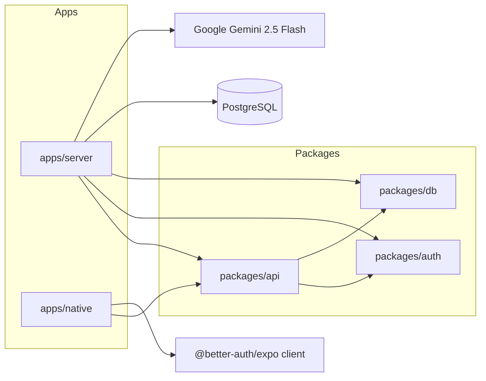
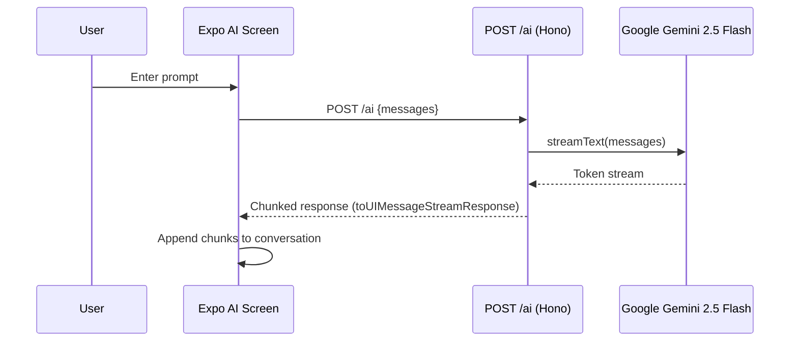
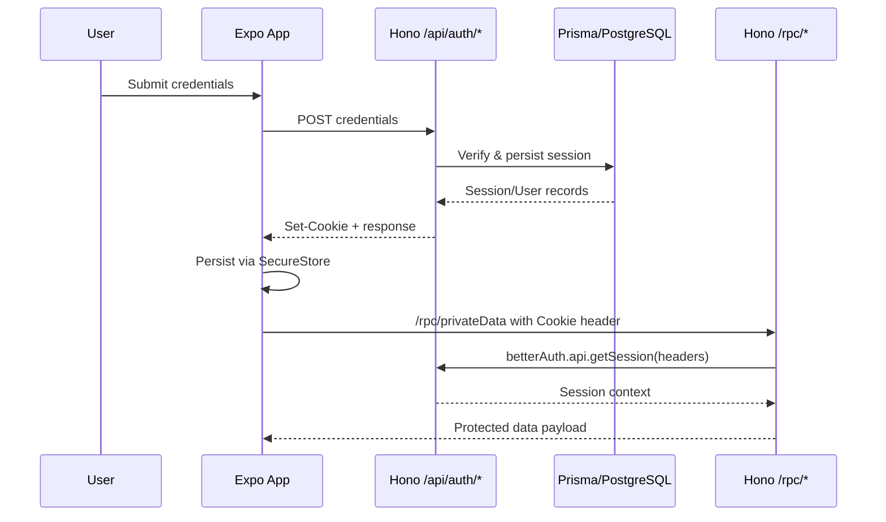

# Turborepo Full-Stack Architecture

## 1. Project Structure & Monorepo Awareness

- **Apps**  
  - `apps/server` – Hono-based Bun service that mounts Better Auth handlers, exposes the `/ai` streaming endpoint, and hosts the oRPC bridge to shared procedures.  
  - `apps/native` – Expo Router mobile client (React Native) that consumes the oRPC endpoints via `@orpc/client` + React Query, handles Better Auth login flows, and provides AI chat and todo demos.
- **Packages**  
  - `packages/api` – Central oRPC router definitions, context factory, and Zod input validation for todos.  
  - `packages/auth` – Better Auth instance configured with Prisma adapter, Expo plugin, secure cookie policy, and trusted origins.  
  - `packages/db` – Prisma client bootstrap plus schema split (`schema.prisma`, `auth.prisma`, `todo.prisma`) compiled to `prisma/generated`.
- **Tooling**  
  - Turborepo orchestrates builds (`turbo.json`), with `tsdown` compiling TypeScript packages/apps to ESM.  
  - Root `tsconfig.base.json` fans out to app-level configs; Expo app extends `expo/tsconfig.base`, server enables JSX for Hono.  
  - Bun (`bun install`, `bun dev`) is the package manager/runtime; no dedicated lint/test tasks ship by default.



## 2. Backend (Hono + Bun)

- **Initialization & Middleware** – `apps/server/src/index.ts` loads env (`dotenv/config`), applies request logging, and configures CORS with `process.env.CORS_ORIGIN`. A global handler injects per-request context (`createContext`) before dispatching to either the oRPC handler (`/rpc/*`) or OpenAPI handler (`/api-reference/*`). Better Auth routes are mounted at `/api/auth/*`, forwarding raw requests into the auth adapter.
- **Streaming AI Endpoint** – `POST /ai` converts Expo chat messages via `convertToModelMessages` and streams Gemini 2.5 Flash output using `streamText(...).toUIMessageStreamResponse()`. Input expects `{ messages: UIMessage[] }` from `@ai-sdk/react`, response is a chunked text stream suitable for SSE/Fetch streaming.
- **RPC Surface** – Shared procedures live in `packages/api/src/routers`. `publicProcedure` exposes `healthCheck` and todo CRUD operations; `protectedProcedure` wraps `privateData`, requiring a valid Better Auth session. Zod schemas enforce payloads for todo mutations.
- **Environment & Secrets** – Key vars: `DATABASE_URL`, `CORS_ORIGIN`, Better Auth secrets (loaded implicitly by the library), AI key material through Google environment, and Expo client URL. No Redis, RabbitMQ, or blob-storage envs are referenced—these capabilities are currently absent.

| Path | Method | Description | Auth Required | Request Shape | Response Shape | Used By |
| --- | --- | --- | --- | --- | --- | --- |
| `/` | GET | Plain-text readiness check. | No | – | `"OK"` | Manual/monitoring |
| `/ai` | POST | Streams Gemini chat completions. | No (consider securing) | `{ messages: [{ role, content/parts }] }` | Stream of text chunks | `apps/native/app/(drawer)/ai.tsx` |
| `/api/auth/*` | GET/POST | Better Auth sign-in, sign-up, session, revoke, etc. | Mixed (depends on sub-route) | JSON or form per Better Auth API | JSON + `Set-Cookie` | `authClient` (SignIn/SignUp/SignOut) |
| `/rpc/*` | POST | oRPC JSON bridge for router procedures (health, todo, private data). | Cookie-based for protected endpoints | `{ path, input }` (internal to oRPC) | JSON result or error envelope | React Query hooks (`orpc.*`) |
| `/api-reference/*` | GET | Generated OpenAPI docs for oRPC router. | Optional | Query per OpenAPI handler | HTML/JSON | Dev tooling |

| Procedure | Route Key | Guard | Validation | Description | Consumed By |
| --- | --- | --- | --- | --- | --- |
| `healthCheck` | `/healthCheck` | Public | – | Returns `"OK"` string for uptime checks. | Home screen status badge |
| `privateData` | `/privateData` | `protectedProcedure` (Better Auth session) | – | Echoes “This is private” and session payload. | Home screen once signed in |
| `todo.getAll` | `/todo/getAll` | Public | – | Lists todos ordered by id. | Todos screen initial load |
| `todo.create` | `/todo/create` | Public | `z.object({ text: string })` | Inserts new todo row and returns it. | Todos screen mutations |
| `todo.toggle` | `/todo/toggle` | Public | `z.object({ id: number, completed: boolean })` | Updates completion flag. | Todos screen mutations |
| `todo.delete` | `/todo/delete` | Public | `z.object({ id: number })` | Removes todo by id. | Todos screen mutations |

- **Auth Context Flow** – Each RPC handler calls `auth.api.getSession({ headers })`, retrieving Better Auth session info from signed cookies. Secure cookie defaults (`sameSite: "none"`, `secure: true`, `httpOnly: true`) enforce HTTPS-only access in production.
- **Error Handling** – `onError` interceptors on both OpenAPI and RPC handlers log server-side stack traces. No standardized JSON error envelope is defined beyond what oRPC returns.
- **Gaps vs Prompt** – Real-time WebSockets, Redis cache, RabbitMQ workers, and blob storage abstractions are not implemented; any integrations would need to be added from scratch.

## 3. Frontend (Expo React Native)

### Navigation & Layout

```mermaid
graph TD
  Stack[app/_layout.tsx<br/>Stack Navigator]
  Stack --> Drawer[(drawer)/_layout.tsx<br/>Drawer Navigator]
  Drawer --> Home[(drawer)/index.tsx]
  Drawer --> Tabs[(drawer)/(tabs)/_layout.tsx]
  Drawer --> Todos[(drawer)/todos.tsx]
  Drawer --> AI[(drawer)/ai.tsx]
  Tabs --> TabHome[(tabs)/index.tsx]
  Tabs --> TabExplore[(tabs)/two.tsx]
  Stack --> Modal[modal.tsx]
```

- `QueryClientProvider` wraps navigation so React Query powers cached RPC calls. Gesture handler and Unistyles theme providers run globally.
- Drawer routes showcase authentication (Home), todos CRUD, AI chat, and tab demo pages.

### Data Fetching & State

- `apps/native/utils/orpc.ts` creates a shared `@orpc/client` instance with a custom `RPCLink`. Cookies from Better Auth are injected into request headers to authorize protected procedures.
- React Query (`useQuery`, `useMutation`) coordinates data lifecycles; optimistic UI is not enabled, but post-mutation `refetch` maintains consistency.
- `useChat` from `@ai-sdk/react` drives the AI conversation. Polyfills (`apps/native/polyfills.js`) add streaming-friendly globals (`TextEncoderStream`, `structuredClone`) for Bun/React Native compatibility.

### Authentication UX

- `authClient` leverages `@better-auth/expo` with SecureStore persistence (`storagePrefix: "picfluencer"`). Email/password flows call `authClient.signIn.email` and `authClient.signUp.email`, handling errors via callbacks.
- Upon successful auth, an HTTP-only session cookie is cached by the client helper, and `queryClient.invalidateQueries()` refreshes private data.

### UI & Styling

- Styling relies on React Native Unistyles theme tokens; icons come from Expo’s Ionicons/MaterialIcons. Forms are handcrafted (`TextInput`, `TouchableOpacity`), with inline validation feedback.
- No push notifications, WebSocket hooks, or background tasks are present in the current mobile code.

## 4. AI Integration Layer

- **Trigger Points** – The AI drawer screen captures user prompts. `sendMessage` marshals inputs to `/ai`, leveraging Expo’s `fetch` polyfill to support streaming responses.
- **Provider** – Only Google’s Gemini 2.5 Flash is wired via `@ai-sdk/google`. No dynamic provider selection or fallback logic exists.
- **Streaming UX** – `DefaultChatTransport` interprets streamed tokens and updates the message list progressively; the UI auto-scrolls to the latest message.



- **Error Handling** – Errors from `useChat` place the screen into a simple error state; no retry or provider fallback is attempted.
- **Security** – AI API keys remain server-only. Clients reference `EXPO_PUBLIC_SERVER_URL` and never touch provider credentials.

## 5. Data Layer (Prisma & PostgreSQL)

- **Models** – `packages/db/prisma/schema` defines:
  - `User`, `Session`, `Account`, `Verification` (Better Auth tables) with cascaded relations.
  - `Todo` (id, text, completed) for the demo list.
- **Client** – `packages/db/src/index.ts` exports a singleton `PrismaClient` consumed by both API routers and Better Auth adapter.
- **Access Patterns** – CRUD operations are straightforward (`findMany`, `create`, `update`, `delete`) inside oRPC handlers. No transactions or raw SQL are present.
- **Migrations** – Prisma migrate scripts are available via `bun db:migrate` and `bun db:push`. No Drizzle ORM, Redis caching, or RabbitMQ consumers exist despite the broader prompt.

## 6. Storage & External Services

- **Blob Storage** – Not implemented. There is no abstraction for S3/R2/GCS/Azure, and no upload/download endpoints. Future work would need environment keys, SDK setup, and client UX.
- **Messaging/Queues** – No Redis or RabbitMQ usage; real-time fan-out relies solely on client polling and streaming HTTP.

## 7. Real-Time & Notifications

- **WebSockets** – The codebase defines no WebSocket server or Socket.IO integration. Real-time experiences rely on streaming HTTP from `/ai` and React Query refetches.
- **Push Notifications** – No push token registration or Expo Notifications logic exists.

| Event | Direction | Purpose | Payload |
| --- | --- | --- | --- |
| – | – | WebSocket channels are not implemented in the current backend. | – |

## 8. Authentication & Security Considerations

- **Better Auth Hardening** – Secure cookie defaults require HTTPS and embed HttpOnly flags. `trustedOrigins` whitelist includes Expo dev URLs and `CORS_ORIGIN`; ensure production domain is supplied.
- **Session Retrieval** – Server-side `createContext` fetches Better Auth session each request, guaranteeing server-trusted auth checks (`protectedProcedure`) before exposing private data.
- **Secret Management** – All secrets (DB, auth, AI) must be supplied via environment variables; none are hard-coded.
- **Client Storage** – Tokens/cookies are handled by Better Auth’s Expo plugin and persisted in SecureStore, preventing leakage via AsyncStorage.
- **Transport** – Use HTTPS/WSS deployments to satisfy cookie requirements and stream security. CORS currently mirrors `process.env.CORS_ORIGIN`, so configure it tightly in production.
- **Validation** – Zod schemas catch malformed todo payloads; other endpoints rely on upstream libraries. Additional validation is recommended for `/ai` input to avoid unexpected provider errors.



## 9. Reference Tables

| Provider / Model | Integration Point | Input | Output | Notes |
| --- | --- | --- | --- | --- |
| Google Gemini 2.5 Flash | `POST /ai` (Hono) via `@ai-sdk/google` | Chat history transformed by `convertToModelMessages` | Streamed chat response tokens | Single provider; temperature/params use SDK defaults |

| Screen / Component | Backend Calls | Data Consumed |
| --- | --- | --- |
| `Home` (`apps/native/app/(drawer)/index.tsx`) | `orpc.healthCheck`, `orpc.privateData`, Better Auth `/api/auth/*` via `authClient` | API connectivity status, private message, session info |
| `TodosScreen` (`apps/native/app/(drawer)/todos.tsx`) | `orpc.todo.getAll/create/toggle/delete` | Todo list items and mutation results |
| `AIScreen` (`apps/native/app/(drawer)/ai.tsx`) | `POST /ai` streaming endpoint | Generated assistant messages in real time |
| `SignIn` / `SignUp` components | Better Auth `/api/auth/sign-in`, `/api/auth/sign-up` | Auth errors/success state; triggers QueryClient refetch |

## Implementation Gaps & Next Steps

- Introduce WebSocket or Server-Sent Events infrastructure if true real-time pub/sub is required beyond the `/ai` stream.
- Add Redis/RabbitMQ only when background work or shared cache becomes necessary.
- Implement storage utilities and file-handling endpoints before promising media uploads.
- Expand unit/integration testing—currently there are no automated tests or linting pipelines registered in Turborepo.
- Harden `/ai` with auth and provider choice toggles if exposing the feature publicly.
