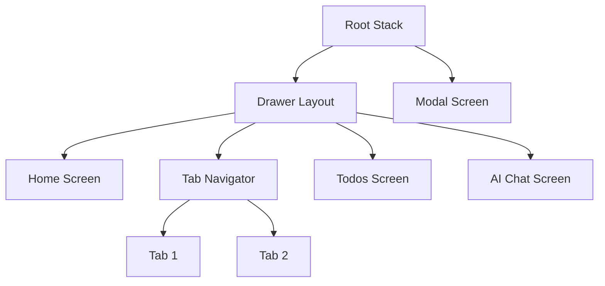
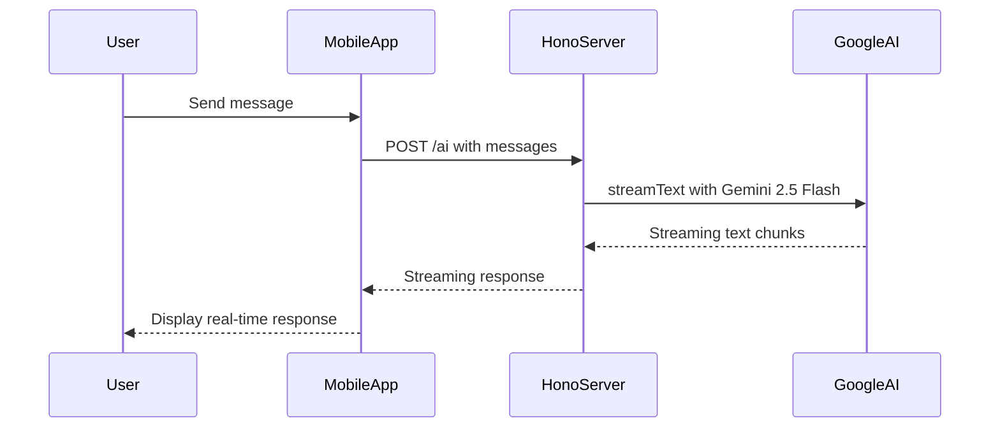
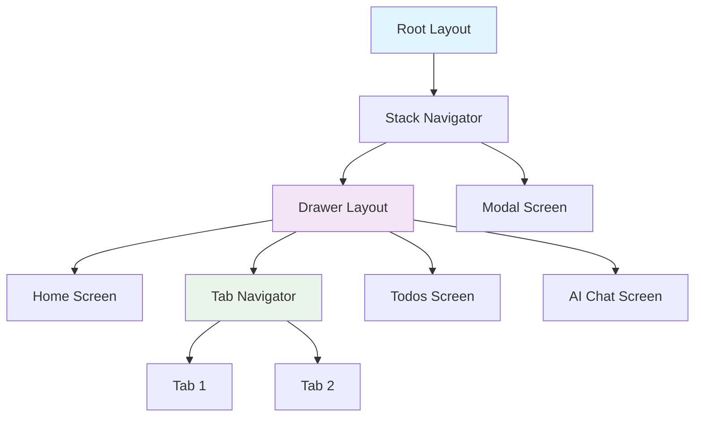
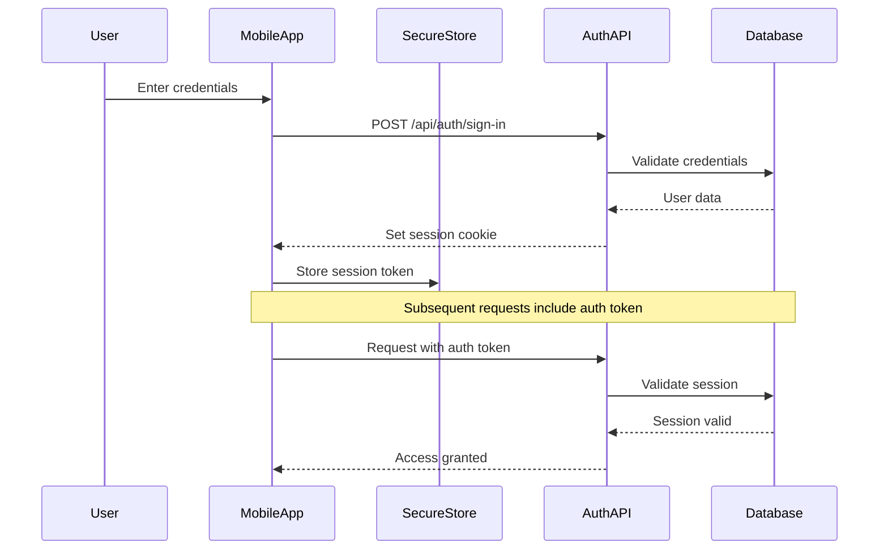

# Picfluencer Architecture Documentation

## Executive Summary

Picfluencer is a full-stack TypeScript monorepo built with modern web technologies, implementing an AI-powered content creation hub for micro and nano influencers. The architecture follows the Better-T-Stack pattern with a focus on type safety, developer experience, and scalability.

## 1. Project Structure and Monorepo Awareness

### Monorepo Package Detection

The Picfluencer project is organized as a Turborepo monorepo with the following structure:

```
picfluencer/
├── apps/
│   ├── native/          # React Native mobile app with Expo
│   └── server/          # Hono API server
└── packages/
    ├── api/             # oRPC router definitions & procedures
    ├── auth/            # Better-Auth configuration
    └── db/              # Prisma schema & client
```

### Shared Libraries Identification

1. **`@picfluencer/db`** - Database layer containing Prisma schemas and client
   - Provides PostgreSQL database access via Prisma ORM
   - Contains schema definitions for auth, todos, and future feature models
   - Export: `prisma` client instance for use across packages

2. **`@picfluencer/auth`** - Authentication configuration
   - Better-Auth setup with Prisma adapter and Expo plugin
   - Handles session management, email/password authentication
   - Export: `auth` instance for server and client integration

3. **`@picfluencer/api`** - Type-safe API layer using oRPC
   - Defines API procedures, input/output schemas with Zod
   - Provides context creation with authentication
   - Export: `appRouter`, context utilities, and procedure builders

### Dependency Mapping

```mermaid
graph TD
    A[apps/server] --> B[@picfluencer/api]
    A --> C[@picfluencer/auth]
    A --> D[@picfluencer/db]

    E[apps/native] --> B
    E --> F[@better-auth/expo]

    B --> C
    B --> D

    C --> D
```

**Dependency Flow:**
- **Server** consumes all three shared packages
- **Native app** consumes the API package and Better-Auth Expo client
- **API package** depends on auth and db packages
- **Auth package** depends on db package for session storage

### Monorepo Tooling (Turborepo Configuration)

The `turbo.json` configuration defines efficient build pipelines:

```json
{
  "tasks": {
    "build": {
      "dependsOn": ["^build"],
      "inputs": ["$TURBO_DEFAULT$", ".env*"],
      "outputs": ["dist/**"]
    },
    "dev": {
      "cache": false,
      "persistent": true
    },
    "db:push": {
      "cache": false,
      "persistent": true
    }
  }
}
```

**Key Features:**
- Incremental builds with dependency graph
- Parallel execution where possible
- Hot reloading for development
- Database operations as persistent tasks

### Package Scripts and Config Files

**Root Configuration:**
- `package.json` - Bun as package manager, workspace configuration
- `tsconfig.base.json` - Base TypeScript configuration
- `bunfig.toml` - Bun runtime configuration

**App-specific:**
- `apps/server/tsconfig.json` - Server TypeScript config
- `apps/native/app.json` - Expo configuration
- `apps/native/babel.config.js` - React Native Babel setup

## 2. Backend API Discovery (Hono.js)

### REST Endpoint Enumeration

The Hono.js server implements a hybrid approach with oRPC procedures and direct HTTP endpoints:

**oRPC Endpoints (via `/rpc/*`):**
- `POST /rpc/healthCheck` - Health check endpoint (public)
- `POST /rpc/privateData` - Private data endpoint (authenticated)
- `POST /rpc/todo/getAll` - Get all todos (public)
- `POST /rpc/todo/create` - Create new todo (public)
- `POST /rpc/todo/toggle` - Toggle todo completion (public)
- `POST /rpc/todo/delete` - Delete todo (public)

**Direct HTTP Endpoints:**
- `POST /ai` - AI chat completion endpoint
- `GET|POST /api/auth/*` - Better Auth authentication endpoints
- `GET /api-reference/*` - OpenAPI documentation
- `GET /` - Health check endpoint

### Route Handlers and Middleware

**Middleware Chain:**
1. **Global Logger** - HTTP request logging
2. **CORS Middleware** - Cross-origin resource sharing
3. **oRPC Handler** - Processes RPC calls at `/rpc/*`
4. **OpenAPI Handler** - Serves API documentation at `/api-reference/*`
5. **Auth Handler** - Better Auth middleware at `/api/auth/*`
6. **AI Endpoint Handler** - Direct AI streaming endpoint

**Authentication Middleware:**
```typescript
const requireAuth = o.middleware(async ({ context, next }) => {
  if (!context.session?.user) {
    throw new ORPCError("UNAUTHORIZED");
  }
  return next({ context: { session: context.session } });
});
```

### Request/Response Validation and Schemas

**Input Validation with Zod:**
```typescript
// Todo creation example
.create: publicProcedure
  .input(z.object({ text: z.string().min(1) }))
  .handler(async ({ input }) => {
    return await prisma.todo.create({
      data: { text: input.text }
    });
  })
```

**Response Patterns:**
- Direct object returns for oRPC procedures
- Streaming responses for AI endpoint
- Error responses via `ORPCError` with appropriate status codes

### Authentication & Authorization (Better Auth Integration)

**Server-side Configuration:**
```typescript
export const auth = betterAuth({
  database: prismaAdapter(prisma, { provider: "postgresql" }),
  trustedOrigins: [process.env.CORS_ORIGIN || "", "mybettertapp://", "exp://"],
  emailAndPassword: { enabled: true },
  advanced: {
    defaultCookieAttributes: {
      sameSite: "none",
      secure: true,
      httpOnly: true,
    },
  },
  plugins: [expo()]
});
```

**Protected Routes:**
- Uses `protectedProcedure` wrapper requiring authentication
- Session validation via Better Auth's session management
- User context available in protected procedures

### AI Service Integrations

**Google Gemini 2.5 Flash Integration:**
```typescript
app.post("/ai", async (c) => {
  const body = await c.req.json();
  const uiMessages = body.messages || [];
  const result = streamText({
    model: google("gemini-2.5-flash"),
    messages: convertToModelMessages(uiMessages),
  });
  return result.toUIMessageStreamResponse();
});
```

**Integration Details:**
- Uses Vercel AI SDK for streamlined AI interactions
- Streaming responses via `streamText` and `toUIMessageStreamResponse`
- Model: Google Gemini 2.5 Flash for chat completions
- Message format conversion using `convertToModelMessages`

### Environment Variables and Config Usage

**Server Environment Variables:**
- `DATABASE_URL` - PostgreSQL connection string
- `BETTER_AUTH_SECRET` - Authentication secret key
- `BETTER_AUTH_URL` - Auth service URL
- `CORS_ORIGIN` - Allowed CORS origins
- `GOOGLE_GENERATIVE_AI_API_KEY` - Google AI API key

**Client Environment Variables:**
- `EXPO_PUBLIC_SERVER_URL` - Backend server URL

## 3. Frontend Application (React Native Expo)

### Expo Router Navigation Structure

**Navigation Hierarchy:**


**File-based Routing:**
- `app/_layout.tsx` - Root layout with QueryClient provider
- `app/(drawer)/_layout.tsx` - Drawer navigation layout
- `app/(drawer)/(tabs)/_layout.tsx` - Tab navigation within drawer
- `app/(drawer)/index.tsx` - Home screen
- `app/(drawer)/ai.tsx` - AI chat interface
- `app/(drawer)/todos.tsx` - Todo management
- `app/modal.tsx` - Modal screen

### Navigation Guards & Auth Flow

**Authentication Integration:**
```typescript
export const authClient = createAuthClient({
  baseURL: process.env.EXPO_PUBLIC_SERVER_URL,
  plugins: [
    expoClient({
      scheme: "mybettertapp",
      storagePrefix: "picfluencer",
      storage: SecureStore,
    }),
  ],
});
```

**Security Features:**
- Expo SecureStore for token storage
- Deep linking support for OAuth flows
- Automatic cookie inclusion in API requests

### API Calls & Data Fetching

**oRPC Client Configuration:**
```typescript
export const link = new RPCLink({
  url: `${process.env.EXPO_PUBLIC_SERVER_URL}/rpc`,
  headers() {
    const headers = new Map<string, string>();
    const cookies = authClient.getCookie();
    if (cookies) {
      headers.set("Cookie", cookies);
    }
    return Object.fromEntries(headers);
  },
});
```

**Data Fetching Pattern:**
- Uses `@orpc/tanstack-query` for React Query integration
- Type-safe API calls with auto-completion
- Automatic cache management and error handling
- Streaming AI responses via `@ai-sdk/react`

### State Management

**React Query Integration:**
- Global query client configured with error handling
- Automatic caching and synchronization
- Type-safe mutations and queries
- Background refetching and stale-while-revalidate

**Component-level State:**
- Local state for UI interactions
- Form state management with controlled components
- Theme state via `react-native-unistyles`

### UI Components and Styling

**Styling Approach:**
- `react-native-unistyles` for utility-first styling
- Theme system with light/dark mode support
- Type-safe style properties
- Responsive design considerations

**Component Library:**
- Custom components: `Container`, `HeaderButton`, `TabBarIcon`
- Authentication components: `SignIn`, `SignUp`
- Expo vector icons for consistent iconography

### Better Auth Integration on Frontend

**Client-side Auth Client:**
```typescript
export const authClient = createAuthClient({
  baseURL: process.env.EXPO_PUBLIC_SERVER_URL,
  plugins: [expoClient({
    scheme: "mybettertapp",
    storagePrefix: "picfluencer",
    storage: SecureStore,
  })],
});
```

**Features:**
- Email/password authentication
- Secure token storage in device keychain
- Automatic session management
- Deep linking for OAuth callbacks

### Error Handling & User Feedback

**Error Handling Strategy:**
- Global error boundaries in React Query
- Component-level error states
- User-friendly error messages
- Retry mechanisms for failed requests

**Loading States:**
- React Query loading indicators
- Skeleton states for data fetching
- Progressive loading for AI responses

## 4. AI Integration Layer

### AI Request/Response Flow

**Chat Completion Flow:**


### AI Models & Providers Table

| Provider/Model | Integration Point | Input | Output | Notes |
|---|---|---|---|---|
| Google Gemini 2.5 Flash | `/ai` endpoint | User messages + context | Streaming text responses | Uses Vercel AI SDK for streaming |

### AI Response Handling & Streaming

**Streaming Implementation:**
- Server uses `streamText` from Vercel AI SDK
- Client uses `useChat` hook from `@ai-sdk/react`
- Real-time message updates during generation
- Automatic error handling and retry logic

## 5. ORM and Data Layer Analysis

### Prisma ORM Integration

#### Schema Definitions

**Database Models:**
```sql
-- User model (from auth.prisma)
CREATE TABLE user (
  _id TEXT PRIMARY KEY,
  name TEXT NOT NULL,
  email TEXT UNIQUE NOT NULL,
  emailVerified BOOLEAN NOT NULL,
  image TEXT,
  createdAt TIMESTAMP NOT NULL,
  updatedAt TIMESTAMP NOT NULL
);

-- Todo model (from todo.prisma)
CREATE TABLE todo (
  id SERIAL PRIMARY KEY,
  text TEXT NOT NULL,
  completed BOOLEAN DEFAULT FALSE
);
```

**Relations:**
- User → Session (one-to-many)
- User → Account (one-to-many)
- Todo model currently independent (to be connected to User in future)

#### Using the Prisma Client

**Client Configuration:**
```typescript
// packages/db/src/index.ts
import { PrismaClient } from '@prisma/client';

const globalForPrisma = globalThis as unknown as {
  prisma: PrismaClient | undefined;
};

export const prisma = globalForPrisma.prisma ?? new PrismaClient();

if (process.env.NODE_ENV !== 'production') globalForPrisma.prisma = prisma;
```

**Query Patterns:**
- Type-safe queries with auto-completion
- Transaction support via `prisma.$transaction()`
- Connection pooling and query optimization
- Automatic schema generation and migration support

## 6. Real-Time Communication & Notifications

### Current Implementation

**AI Streaming:**
- Real-time text streaming via HTTP streaming
- Uses Vercel AI SDK's streaming capabilities
- No WebSocket implementation currently
- Progressive enhancement for user experience

**Future Considerations:**
- WebSocket implementation planned for real-time collaboration
- Push notification integration for mobile app
- Real-time todo synchronization across devices

## 7. Security and Best Practices

### Authentication Security

**Token Management:**
- HTTP-only, secure cookies for session storage
- Expo SecureStore for client-side token storage
- SameSite="none" and Secure flags for cross-origin requests
- Automatic token refresh and expiration handling

**Session Security:**
- Server-side session validation on each request
- User context injection in protected procedures
- Automatic session cleanup and expiration

### Transport Security

**HTTPS/WSS:**
- All API calls use HTTPS in production
- CORS properly configured for allowed origins
- Secure cookie attributes for production deployment

### Input Validation & Sanitization

**Server-side Validation:**
- Zod schemas for all input validation
- Type safety from database to API
- Automatic sanitization and type coercion

**Client-side Validation:**
- Form validation with controlled components
- Real-time validation feedback
- Prevents invalid requests to server

### API Security

**Rate Limiting:**
- Currently not implemented (recommended for production)
- Should add rate limiting for AI endpoints
- DDoS protection considerations

**CORS Configuration:**
- Strict origin policy in production
- Proper preflight handling
- Credential support for authenticated requests

## 8. Documentation: Diagrams and Tables

### Monorepo Package Dependency Diagram

```mermaid
graph TD
    A[apps/server] --> B[@picfluencer/api]
    A --> C[@picfluencer/auth]
    A --> D[@picfluencer/db]

    E[apps/native] --> B
    E --> F[@better-auth/expo]
    E --> G[expo-secure-store]

    B --> C
    B --> D
    B --> H[@orpc/server]
    B --> I[zod]

    C --> D
    C --> J[better-auth]

    D --> K[@prisma/client]

    L[External Services] --> M[PostgreSQL]
    L --> N[Google AI]
```

### Mobile Navigation Structure Diagram



### Authentication Flow Diagram



### REST API Endpoint Table

| Path | Method | Description | Auth Required | Request Data | Response Data | Used By |
|------|--------|-------------|---------------|--------------|---------------|----------|
| `/rpc/healthCheck` | POST | Health check | No | None | "OK" | Native App |
| `/rpc/privateData` | POST | Private user data | Yes | None | `{ message, user }` | Native App |
| `/rpc/todo/getAll` | POST | Get all todos | No | None | `Todo[]` | Native App |
| `/rpc/todo/create` | POST | Create todo | No | `{ text: string }` | `Todo` | Native App |
| `/rpc/todo/toggle` | POST | Toggle todo | No | `{ id: number, completed: boolean }` | `Todo` | Native App |
| `/rpc/todo/delete` | POST | Delete todo | No | `{ id: number }` | `Todo` | Native App |
| `/ai` | POST | AI chat completion | No | `{ messages: Message[] }` | Streaming text | Native App |
| `/api/auth/*` | GET/POST | Auth endpoints | Varies | Varies | Varies | Native App |
| `/api-reference/*` | GET | OpenAPI docs | No | None | OpenAPI spec | Developers |

### Frontend Component to API Mapping Table

| Screen/Component | API Calls Made | Data Consumed |
|------------------|----------------|---------------|
| `AIScreen` | `POST /ai` | Streaming AI responses |
| `TodosScreen` | `todo.getAll`, `todo.create`, `todo.toggle`, `todo.delete` | Todo list, CRUD operations |
| `SignIn/SignUp` | `/api/auth/sign-in`, `/api/auth/sign-up` | Authentication state |
| All screens | `/rpc/healthCheck` | App health status |
| Protected screens | `/rpc/privateData` | User session data |

### Technology Stack Summary

| Layer | Technology | Purpose |
|-------|------------|---------|
| **Runtime** | Bun 1.2.22 | Fast JavaScript runtime |
| **Monorepo** | Turborepo | Build system and caching |
| **Backend** | Hono.js | Lightweight web framework |
| **API** | oRPC | Type-safe RPC with OpenAPI |
| **Database** | PostgreSQL + Prisma | Relational database and ORM |
| **Auth** | Better-Auth | Authentication solution |
| **Frontend** | React Native + Expo | Cross-platform mobile app |
| **Navigation** | Expo Router | File-based routing |
| **Styling** | React Native Unistyles | Utility-first styling |
| **State** | TanStack Query | Server state management |
| **AI** | Vercel AI SDK + Google Gemini | AI integration |
| **Development** | TypeScript | Type safety throughout |

## Conclusion

The Picfluencer architecture demonstrates a modern, type-safe approach to full-stack development with React Native and Hono.js. The monorepo structure provides excellent code sharing and maintainability, while the Better-T-Stack ensures developer productivity and type safety across the entire stack.

Key strengths include:
- End-to-end type safety with TypeScript and oRPC
- Modern authentication with Better-Auth
- Scalable monorepo structure with Turborepo
- Cross-platform mobile development with Expo
- Real-time AI integration with streaming responses
- Secure session management and token handling

The architecture is well-positioned for the feature requirements outlined in the PRD, with solid foundations for implementing content creation workflows, AI-powered tools, and influencer management features.